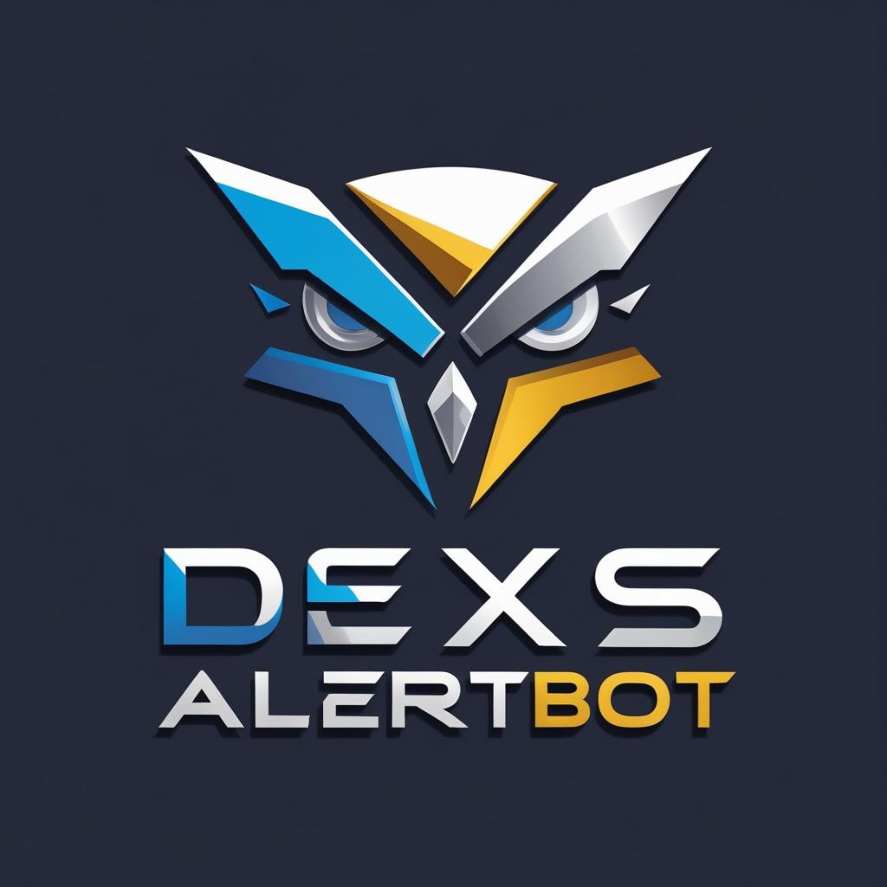
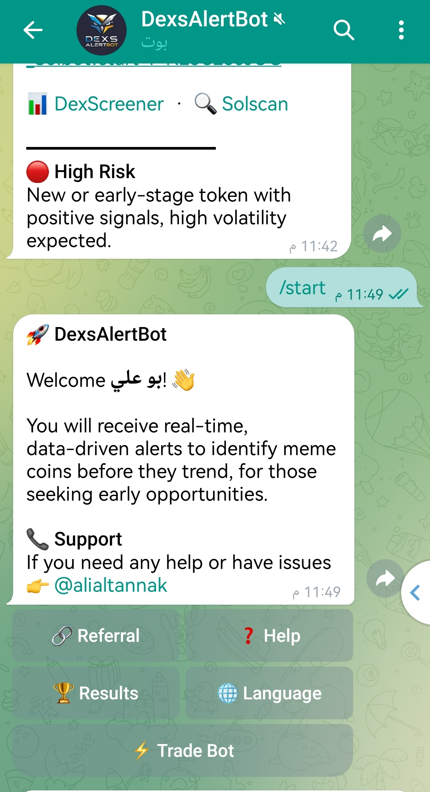
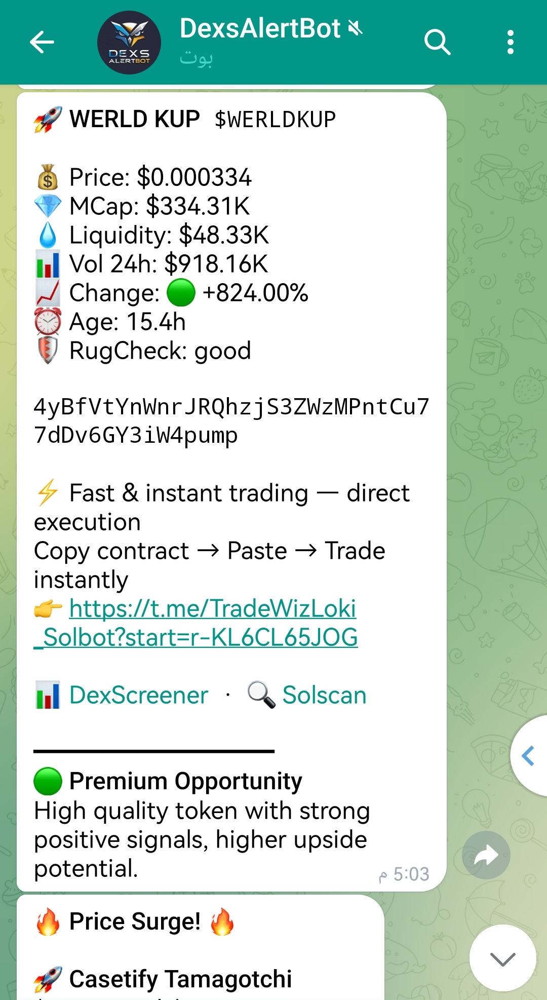
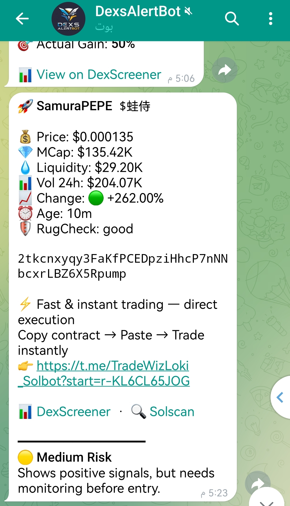
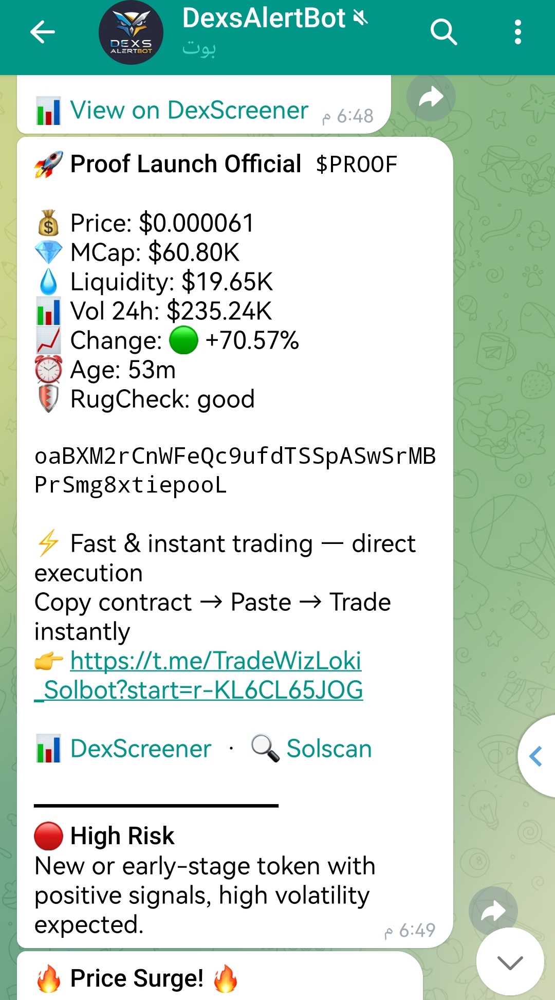
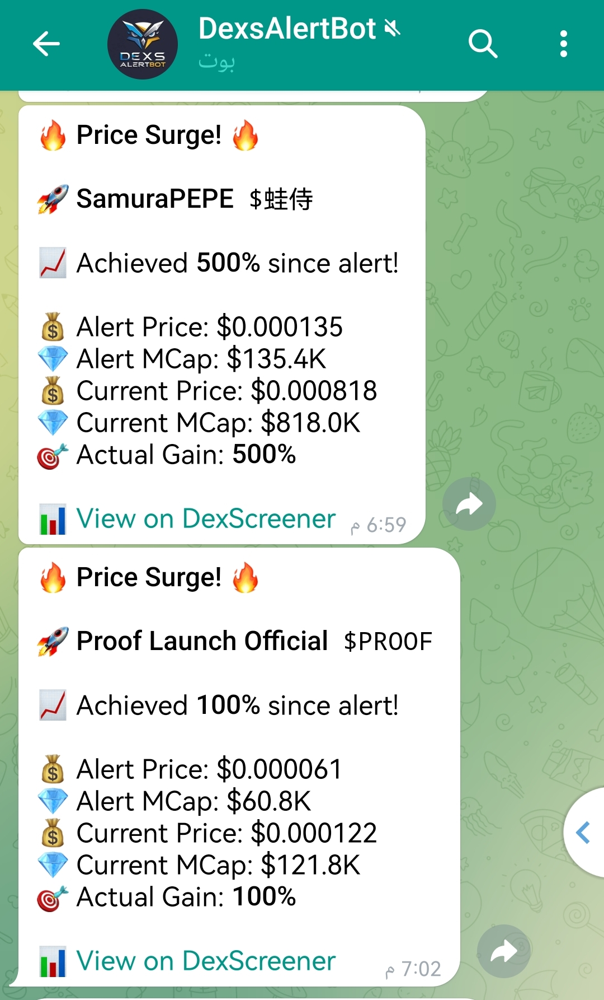
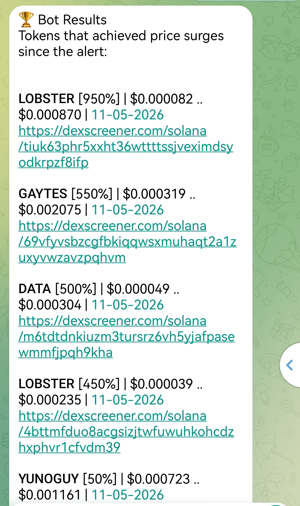

# DexsAlertBot 🚀

### Catch meme coins before the trend.

**A real-time Solana alert bot built to detect early meme coin activity — before momentum reaches the wider market.**

 

---

## 📖 Overview

Most traders enter **after** the hype has already started.

**DexsAlertBot** is designed to do the opposite — it monitors new opportunities, sudden momentum shifts, rapid price movements, and trending activity across the Solana ecosystem, then delivers fast, data-driven alerts straight to your Telegram.

The goal is simple: **detect momentum early and react faster.**

DexsAlertBot helps you discover meme coins:

- **Before** they become trending
- **During** sudden momentum spikes
- **During** fast market moves and rapid pumps
- **While** volume and attention start accelerating

---

## 🤖 Getting Started

Open the bot, send `/start`, and you're in. You'll instantly receive real-time, data-driven alerts and gain access to the full menu — **Referral**, **Help**, **Results**, **Language**, and a direct **Trade Bot** link.

> 👉 **[Start the bot now → t.me/DexsAlertBot](https://t.me/DexsAlertBot)**

---

## ✨ Features

| | Feature | Description |
|---|---|---|
| 🚀 | **Early meme coin alerts** | Surfaces tokens while activity is still building |
| ⚡ | **Instant momentum detection** | Flags sudden spikes the moment they happen |
| 📈 | **Real-time pump & trend monitoring** | Continuous tracking across the Solana ecosystem |
| 🛡️ | **Built-in RugCheck status** | Each alert includes a safety check signal |
| 🎯 | **Risk classification** | Every token is tagged 🟢 Premium / 🟡 Medium / 🔴 High |
| 📊 | **Live performance tracking** | Follow-up "Price Surge" alerts show real gains since the call |
| 🏆 | **Public proof of results** | Browse a transparent record of past alert performance |
| 🔗 | **One-tap trade link** | Jump straight from an alert to trading |
| 🌐 | **Multi-language support** | Switch the bot's language anytime |
| 🤝 | **Referral system** | Share the bot through your own referral link |
| ⏱️ | **Ultra-fast notifications** | Alerts delivered directly to Telegram in real time |

---

## 🔍 Inside an Alert

Every alert is packed with the data you need to make a fast decision — at a glance, with no extra lookups.

Each alert includes:

- 💰 **Price** — current token price
- 💎 **Market Cap** — live MCap
- 💧 **Liquidity** — available pool liquidity
- 📊 **Volume 24h** — trading volume over the last 24 hours
- 📈 **Change** — price movement, color-coded 🟢 / 🔴
- ⏰ **Age** — how long the token has existed
- 🛡️ **RugCheck** — safety status signal
- 📋 **Contract Address** — copy-ready, one tap to trade
- 🔗 **Quick links** — direct **DexScreener** and **Solscan** buttons

---

## 🎯 Risk Classification

Not every opportunity carries the same risk. DexsAlertBot labels **every** token with a clear, color-coded rating so you always know what you're looking at before you act.

<table>
  <tr>
    <td align="center" width="33%">
       
      <b>🟢 Premium Opportunity</b> 
      High quality token with strong positive signals and higher upside potential.
    </td>
    <td align="center" width="33%">
       
      <b>🟡 Medium Risk</b> 
      Shows positive signals, but needs monitoring before entry.
    </td>
    <td align="center" width="33%">
       
      <b>🔴 High Risk</b> 
      New or early-stage token with positive signals and high volatility expected.
    </td>
  </tr>
</table>

---

## 📊 Live Performance Tracking

DexsAlertBot doesn't just call a token and disappear. When a previously alerted token surges, the bot fires a **🔥 Price Surge!** update — showing the **alert price**, the **current price**, and the **actual gain achieved since the alert**.

---

## 🏆 Proof & Transparency

DexsAlertBot publicly showcases previous alerts and their token performance, so anyone can review successful detections and historical results directly from the bot via the **🏆 Results** menu.

This lets traders **verify the effectiveness of the alerts in real market conditions** — no cherry-picking, just the record.

---

## 💡 Why DexsAlertBot?

> Most traders enter after the hype already starts.

DexsAlertBot focuses on identifying **early activity and momentum** before the majority of the market notices it — and backs every call with a transparent, public record of results.

Built for traders who want **speed, early signals, and real-time awareness.**

---

## 🌐 Official Links

| Platform | Link |
|---|---|
| 💬 **Telegram** | [t.me/DexsAlertBot](https://t.me/DexsAlertBot) |
| 𝕏 **Twitter / X** | [x.com/dexsalertbot](https://x.com/dexsalertbot) |
| 🎵 **TikTok** | [tiktok.com/@dexsalertbot](https://www.tiktok.com/@dexsalertbot) |
| 📸 **Instagram** | [instagram.com/dexsalertbot](https://instagram.com/dexsalertbot) |
| 🌳 **Linktree** | [linktr.ee/dexsalertbot](https://linktr.ee/dexsalertbot) |

---

## 💰 Pricing

DexsAlertBot is currently **free to use.**

A premium version or small subscription plan may be introduced later as the platform grows.

---

## 🆘 Support

Need help or run into an issue? Reach out directly via Telegram:

👉 **[@alialtannak](https://t.me/alialtannak)**

---

**Built for serious Solana meme coin traders** 🚀

⚠️ DexsAlertBot provides informational alerts only and is not financial advice. Always do your own research (DYOR). Trading meme coins is high risk.

